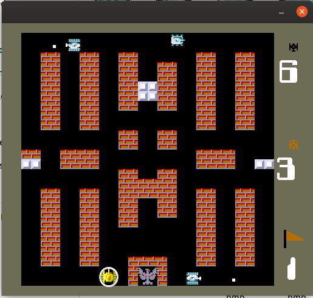
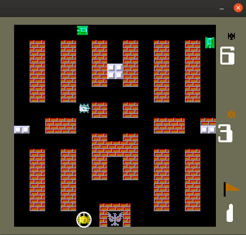
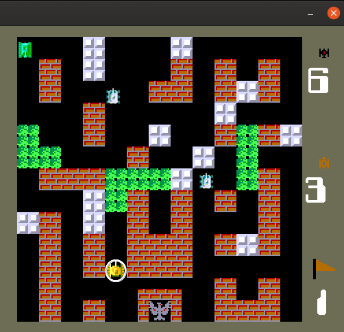
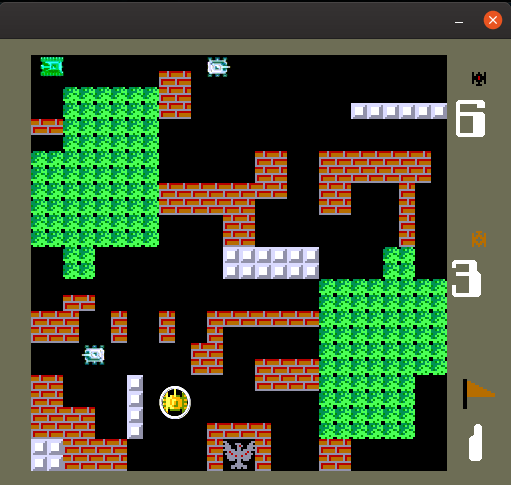
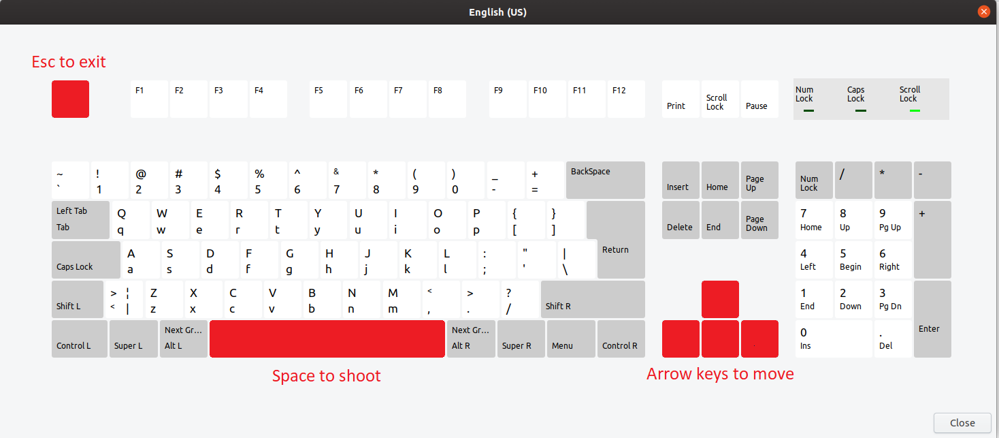

# Battle City game in C
Battle City is a multi-directional shooter video game for the Family Computer produced and published in 1985 by Namco.

  

I developed a version in C using the SDL graphic library.

## Demo

[Youtube Video](https://www.youtube.com/watch?v=QQdxiQNExBM "Youtube Video")

This is meant to be an educational project to learn about the use of the SDL graphic library

>     Make sure you have already installed SDL 1.2 library on your PC to compile it! 

__________________

## Overview

The game has only implemented the first 3 levels of the game for now.

MAP 1 | MAP 2 | MAP 3
------------ | ------------- | -------------
 |  | 

### Controls

### Enemies

There are 4 kinds of enemies:

1. Gray Enemy 
2. Gray Enemy (faster)
3. Gray and Red Enemy (faster)
4. 3 Color Enemy (3 lives)

>**NOTE:** There are only 6 enemies per-level 
>
>>2 sets of 3 enemies per map
